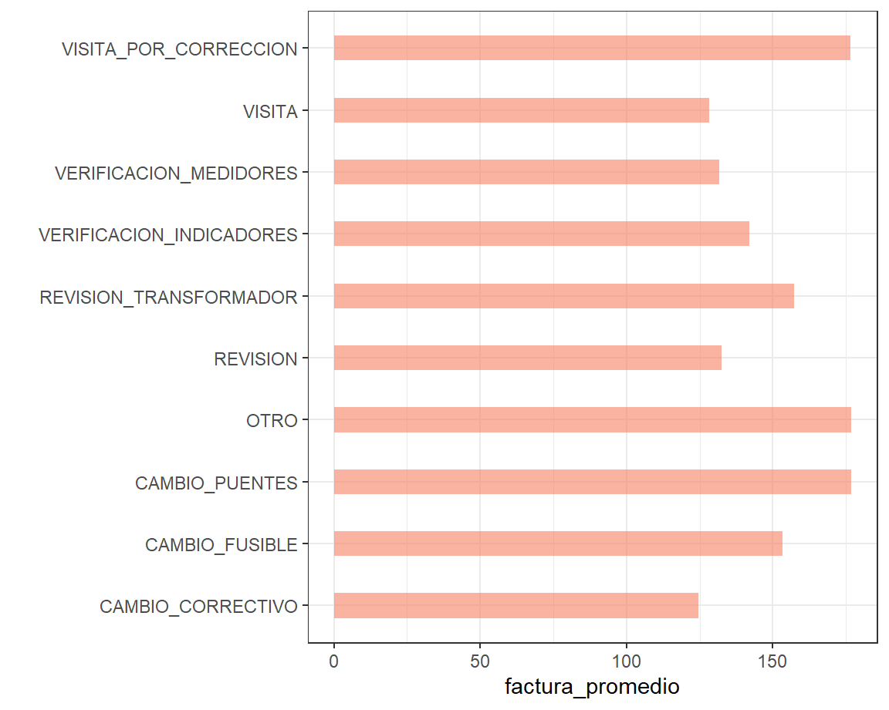
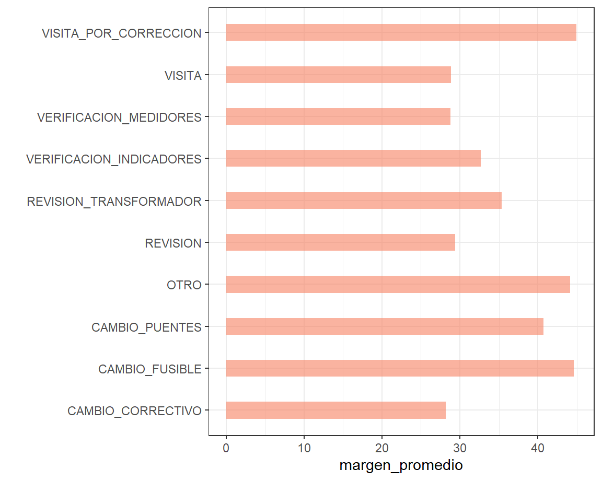
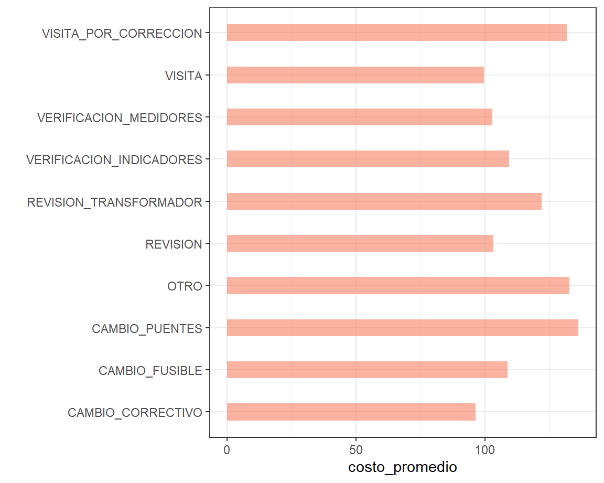
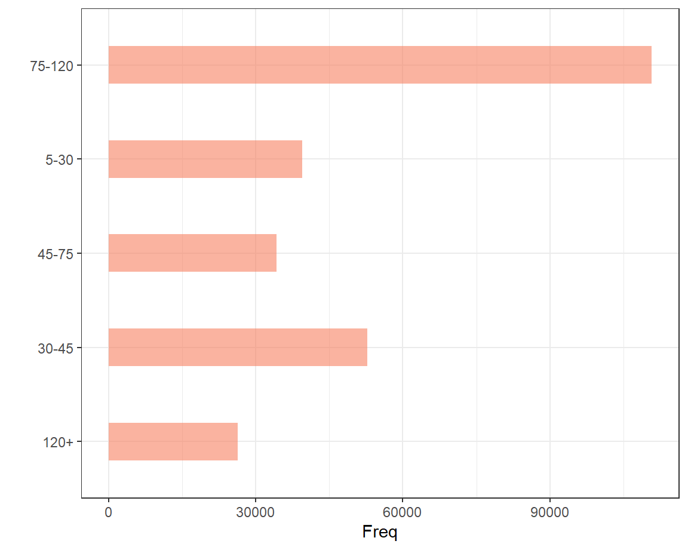
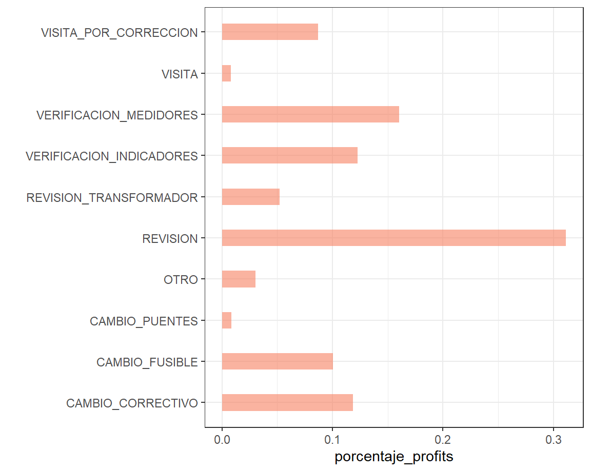
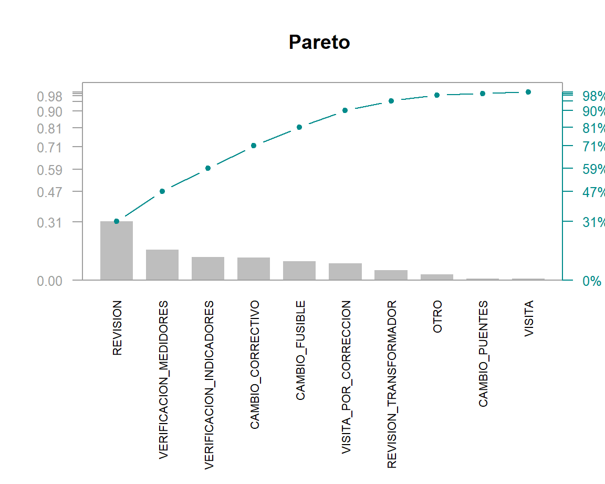

---
title: "Energia Privada S.A  ⚡"
output: 
  flexdashboard::flex_dashboard:
    theme: cosmo
    orientation: rows
    vertical_layout: fill
--- 


<div class="knitr-options" data-fig-width="576" data-fig-height="460"></div>


# Estado de resultados


## 

<h1>Estado de resultados</h1>

##


### Profit

<div class="knitr-options" data-fig-width="576" data-fig-height="460"></div>
preserve4905c000f5bd35cc

### Revenue

<div class="knitr-options" data-fig-width="576" data-fig-height="460"></div>
preservecf06e698395754ff


### Costs

<div class="knitr-options" data-fig-width="576" data-fig-height="460"></div>
preserve6a124291a4d21f82


##

###

<div class="knitr-options" data-fig-width="576" data-fig-height="460"></div>
preserve44f07d7022f5b4a6


# Tarifario

## 

### 

<h1>Tarifario</h1>

<div class="knitr-options" data-fig-width="576" data-fig-height="460"></div>
preservefcffe72f8c2d1019

##

###


<div class="knitr-options" data-fig-width="576" data-fig-height="460"></div>



###


<div class="knitr-options" data-fig-width="576" data-fig-height="460"></div>



###


<div class="knitr-options" data-fig-width="576" data-fig-height="460"></div>



# Tarifas por Cliente

##

###


<h1> Las tarifas son un poco altas </h1>


<div class="knitr-options" data-fig-width="576" data-fig-height="460"></div>
preserve168243f58d576d04


##


###


 
 
 
<div class="knitr-options" data-fig-width="576" data-fig-height="460"></div>



# Margenes


##


###


<div class="knitr-options" data-fig-width="576" data-fig-height="460"></div>
preserveaa89d0db1b0c8b5b


##


###


<div class="knitr-options" data-fig-width="576" data-fig-height="460"></div>



###


<div class="knitr-options" data-fig-width="576" data-fig-height="460"></div>


# Centros


##


###
<div class="knitr-options" data-fig-width="576" data-fig-height="460"></div>
preserve8be0bfb0f1bb35ae


# 80/20

##


###

<div class="knitr-options" data-fig-width="576" data-fig-height="460"></div>



# Postes

##


###


<div class="knitr-options" data-fig-width="576" data-fig-height="460"></div>


##
### 
<div class="knitr-options" data-fig-width="576" data-fig-height="460"></div>
preserve96d89ab9f1d84c48

<div class="knitr-options" data-fig-width="576" data-fig-height="460"></div>
preserved07aeea471b92e81

###


<div class="knitr-options" data-fig-width="576" data-fig-height="460"></div>
preserve960fa99ea9dba23a


<!-- # views -->

<!-- ## -->

<!-- ### -->

<!-- ```{r} -->
<!-- valueBox(mean(vidsData$viewCount),  -->
<!--          caption = "Promedio de views", -->
<!--          icon = "fa-eye") -->
<!-- ``` -->


<!-- ### -->

<!-- ```{r} -->
<!-- valueBox(max(vidsData$viewCount),  -->
<!--          caption = "Maximo de views", -->
<!--          icon = "fa-arrow-alt-circle-up", -->
<!--          color = "success") -->
<!-- ``` -->

<!-- ### -->

<!-- ```{r} -->
<!-- valueBox(min(vidsData$viewCount),  -->
<!--          caption = "Minimo de views", -->
<!--          icon = "fa-arrow-alt-circle-down", -->
<!--          color = "warning") -->
<!-- ``` -->


<!-- Row {data-height=350} -->
<!-- ------------------------------------- -->


<!-- ### Views a traves del tiempo  -->

<!-- ```{r} -->
<!-- options(scipen = 999) -->
<!-- ggplot(data = vidsData, aes(x = date, y = viewCount))+ -->
<!--   geom_line(color = "#00AFBB", size = 2) -->
<!-- ``` -->


<!-- ### Distribucion de las views  -->

<!-- ```{r} -->
<!-- vidsData %>%  -->
<!--   ggplot(aes(x=viewCount)) + geom_density() -->
<!-- ``` -->


<!-- # likes -->

<!-- ## -->

<!-- ### -->

<!-- ```{r} -->
<!-- valueBox(mean(vidsData$likeCount), -->
<!--          caption = "Promedio de likes", -->
<!--          icon = "fa-thumbs-up") -->
<!-- ``` -->

<!-- ### -->

<!-- ```{r} -->
<!-- valueBox(max(vidsData$likeCount),  -->
<!--          caption = "Maximo de likes", -->
<!--          icon = "fa-arrow-alt-circle-up", -->
<!--          color = "success") -->
<!-- ``` -->

<!-- ### -->

<!-- ```{r} -->
<!-- valueBox(min(vidsData$likeCount),  -->
<!--          caption = "Minimo de likes", -->
<!--          icon = "fa-arrow-alt-circle-down", -->
<!--          color = "warning") -->
<!-- ``` -->


<!-- Row {data-height=350} -->
<!-- ------------------------------------- -->


<!-- ### Likes a traves del tiempo  -->
<!-- ```{r} -->
<!-- ggplot(data = vidsData, aes(x = date, y = likeCount))+ -->
<!--   geom_line(color = "#00AFBB", size = 2) -->
<!-- ``` -->

<!-- ### Distribucion de las likes  -->


<!-- ```{r} -->
<!-- vidsData %>%  -->
<!--   ggplot(aes(x=likeCount)) + geom_density() -->
<!-- ``` -->


